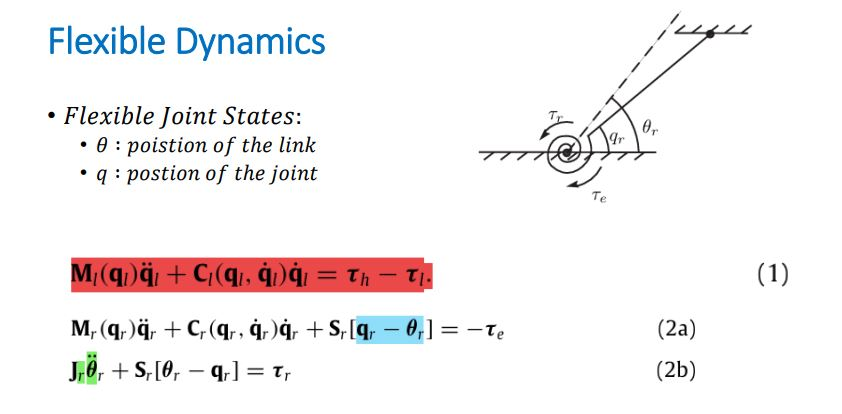
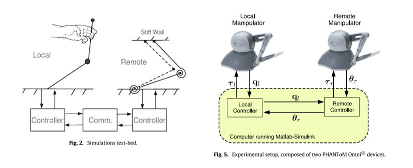
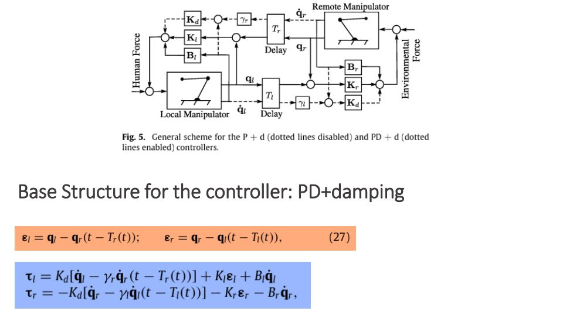

# Flexible Joint Teleoperation Manipulator Simulation

This project is a **Simulink** model that simulates a flexible joint teleoperation manipulator with a bilateral structure. The system involves a master-slave tracking architecture, with a focus on handling key challenges such as **variable time delays**, **nonlinear flexible dynamics**, and ensuring effective master-slave synchronization.

## Key Challenges
1. **Variable Time Delay**: The system incorporates varying time delays to simulate real-world teleoperation scenarios where communication between the master and slave sides may not be constant.
2. **Nonlinear Flexible Dynamics**: The manipulator has flexible joints, introducing nonlinearity into the system, making control and stability more challenging.
3. **Master-Slave Tracking**: The system aims to maintain accurate tracking between the master and slave sides, ensuring that the slave manipulator follows the master's movements as closely as possible.

## Controller Design
The system utilizes a **PD+damping** or **P+damping** control strategy to manage the nonlinear flexible dynamics and ensure stability during variable time delays. These controllers are designed to mitigate oscillations caused by the joint flexibility and delays in communication.

## Reference Paper
This simulation is based on the concepts discussed in the paper:  
**"Control of teleoperators with joint flexibility, uncertain parameters, and time-delays"**  
The paper provides insights into controlling teleoperation systems with inherent flexibility and variable delay conditions, which are modeled in this project.

## How to Run the Simulation
1. Open the Simulink model in MATLAB.
2. Run the simulation to observe the behavior of the teleoperation system with varying time delays and joint flexibility.
3. Adjust the parameters to explore different control strategies and their impact on system performance.
